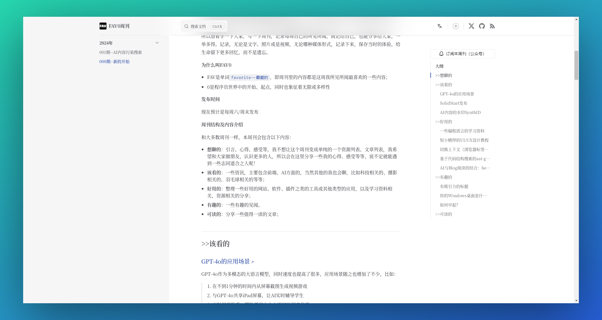

<h4 align="right"><strong>English</strong> | <a href="./README.zh.md">简体中文</a> | <a href="./README.ja.md">日本語</a></h4>

<div align="center">

<a href="https://fav0.com" target="blank">
  
</a>

# FAV0 Weekly


Record what I see and hear every week, mainly focusing on front-end, AI, and computer-related content.

Updated every Saturday/weekend, with updates synchronized with releases. Feel free to star/watch releases in custom to stay updated with the latest weekly releases.

[](./CHANGELOG.md)


[](https://github.com/Justin3go/FAV0/pulls)
[](https://github.com/Justin3go/FAV0/issues/new/choose)
[](https://github.com/Justin3go/FAV0/issues/new/choose)



</div>

## Features


1. 🌓 Provides light and dark mode switching to adapt to different reading environments.
2. 🌍 Supports bilingual interface in Chinese and English for the convenience of users of different languages.
3. 📡 Provides RSS subscription function, supporting updates in both Chinese and English.
4. 💬 Integrated Giscus comment system for user communication and feedback.
5. 🖼️ Supports high-definition image preview for optimized visual experience.
6. 📜 Allows customization of font settings for improved reading comfort.
7. 🔍 Performs SEO optimization, including Sitemap generation, Twitter Card, and Open Graph tag support to improve search engine visibility.


## Development

```bash
git clone git@github.com:Justin3go/FAV0.git
cd FAV0

npm i -g pnpm # if needed
pnpm i
pnpm docs:dev
```
1. Modify the giscus comment configuration in `.vitepress/theme/components/Comments.vue`, specifically the `giscus` configuration;
2. Modify the sidebar configuration, RSS configuration, metadata configuration, etc., in the `utils` folder;
3. Modify the related configurations in the `config` folder, mainly title, description, etc.;
4. Change the content of the articles in the `posts/**` and `en/posts/**` directories to your own content;

## License

This repository is dual-licensed under the MIT License and CC-BY-4.0 License:

- All `.md` files are licensed under the CC-BY-4.0 License, you need to retain attribution.
- Other code files are licensed under the MIT License, you may use them freely.

For more details, please see the [LICENSE](./LICENSE) file.
